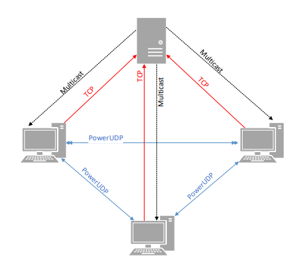

# PowerUDP

**Course:** Computer Networks 2024/2025  
**Institution:** Department of Informatics Engineering (DEI) - University of Coimbra

## Overview
PowerUDP is a custom communication protocol built on top of UDP that introduces reliability guarantees typically found in connection-oriented protocols. It was developed as a practical assignment for the Introduction to Communication Networks course at the University of Coimbra (2024/2025 academic year).

The goal of this project is to implement a reliable data transfer mechanism over UDP using the C programming language and network sockets, operating within a simulated network environment utilizing Docker, NAT routing, and Multicast configurations.

## Architecture
The system operates on a hybrid communication architecture:
* **Client-to-Client (PowerUDP):** Unicast communication between hosts using the custom PowerUDP protocol with configurable reliability.
* **Client-to-Server (TCP):** Clients register with a central server using a pre-shared key (PSK) and request protocol configuration changes.
* **Server-to-Client (Multicast):** The server broadcasts the active PowerUDP configuration (e.g., enabling/disabling backoff, timeouts) to all registered clients simultaneously.

## Key Features

### 1. Reliable UDP Communication
PowerUDP encapsulates application data with a custom header to ensure reliable delivery through:
* **Acknowledgments (ACK/NACK):** The protocol operates on a wait-and-verify model. A new message is only sent once the previous one is confirmed.
* **Message Ordering:** Sequence numbers are used to ensure packets are processed in the correct order, rejecting duplicates or out-of-order packets.

### 2. Retransmission and Exponential Backoff
To handle packet loss, the protocol implements:
* **Timers:** If an ACK is not received within a base timeout period, the packet is retransmitted up to a maximum number of retries.
* **Exponential Backoff:** The wait time between failed retransmissions increases exponentially based on the formula: `Tn = Tmin * 2^n`.

### 3. Dynamic Protocol Configuration
The reliability features of the protocol (retransmissions, backoff, sequence enforcement, timeouts, and max retries) can be dynamically toggled across the network by the server via Multicast messages.

### 4. Testing and Statistics API
The protocol API exposes functions to the application layer to:
* Inject artificial packet loss for testing retransmission behaviors.
* Retrieve statistics regarding the last sent message, including delivery time and the number of retransmissions.

## Technology Stack
* **Language:** C
* **Networking:** TCP, UDP, and IP Multicast Sockets
* **Environment:** Linux (Docker containers)
* **Routing:** Cisco Routers setup with SNAT/DNAT, static routing, and PIM sparse-dense-mode for Multicast routing.

## Network Topology Context
The project was designed to run on a specific subnet topology containing 3 routers and 2 switches. The clients reside in a private network behind a router configured with Source NAT (SNAT) and Destination NAT (DNAT), while the server resides in a separate private network, requiring strict routing rules to allow end-to-end and multicast communication.
